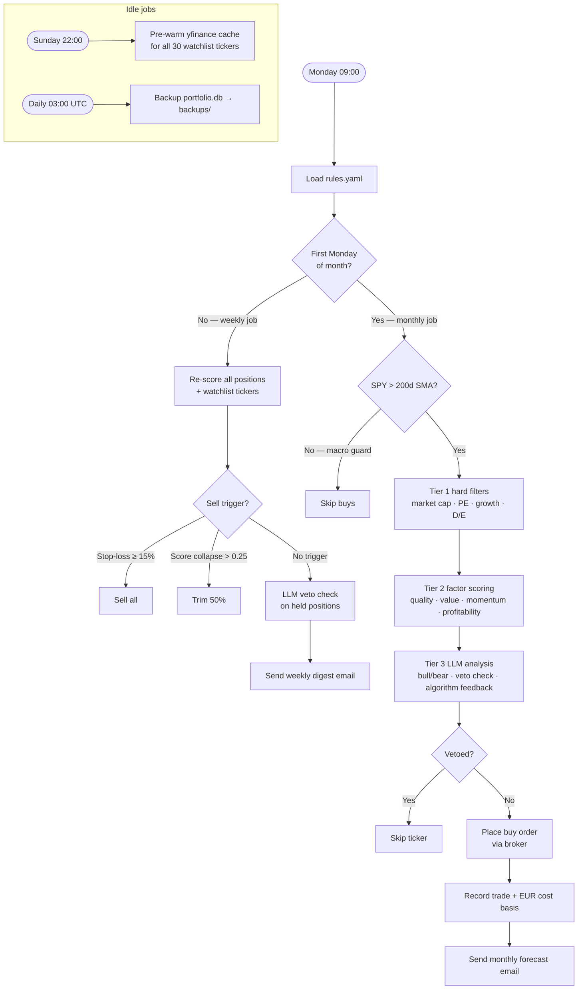

# WarBuf

Autonomous long-term investment bot. Math scores. LLM analyses. Human controls `rules.yaml`.

---

## How it works



---

## Stack

| Layer        | Tool                                                            |
| ------------ | --------------------------------------------------------------- |
| Scheduler    | APScheduler (weekly + monthly + idle jobs)                      |
| Scoring      | 4-factor composite — quality · value · momentum · profitability |
| LLM analysis | LiteLLM → GitHub Models (gpt-4o)                                |
| Broker       | Paper (default) or IBKR Web API                                 |
| Persistence  | SQLite — EUR-native accounting                                  |
| Dashboard    | Streamlit (always-on, HTTPS via Caddy)                          |
| Hosting      | Hetzner CX23 (~€4.49/month)                                     |
| CI/CD        | GitHub Actions — lint · tests · security scan · auto-deploy     |

---

## Quickstart

```bash
cp .env.template .env   # fill in EMAIL_*, GITHUB_TOKEN
python3 -m venv .venv && .venv/bin/pip install -r requirements.txt
.venv/bin/python main.py          # starts scheduler (paper mode safe)
.venv/bin/streamlit run dashboard.py   # dashboard at http://localhost:8501
```

All tunable parameters (weights, filters, model, watchlist) live in `rules.yaml` — no code edits needed.

See [AGENTS.md](AGENTS.md) for full architecture and coding conventions.
