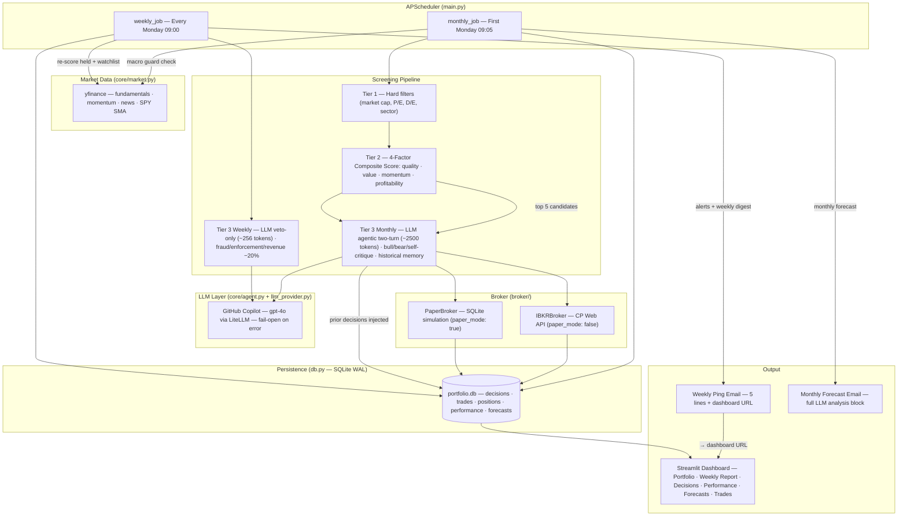

# WarBuf — Long-Term Investment Bot

## What it does

Autonomous long-term investment agent: scores stocks weekly using proven quantitative factors, executes on Interactive Brokers, and delivers a minimalist weekly ping email + full report on the Streamlit dashboard.

**Not a day-trading bot.** Hold periods: months to years. Math decides. LLM vetoes.

---

## Architecture



---

## Constraints & Targets

| Parameter               | Value                                   |
| ----------------------- | --------------------------------------- |
| Monthly contribution    | €300                                    |
| Full strategy active at | €3,000 portfolio                        |
| Max position size       | 15% of portfolio                        |
| Minimum position size   | €300 (otherwise skip, accumulate)       |
| Broker                  | Interactive Brokers (IBKR Web API)      |
| Hosting                 | Hetzner CX23 (~€4.49/month)             |
| LLM cost                | <€1/month (veto-only, ~2K tokens/month) |

---

## Ramp-Up Schedule

| Phase      | Capital | Mode         | Action                               |
| ---------- | ------- | ------------ | ------------------------------------ |
| Month 1–3  | €900    | Paper        | Deploy into SPY only                 |
| Month 4–6  | €1,800  | Paper → Live | Add QQQ; start 2 satellite positions |
| Month 7–10 | €3,000  | Live         | Full satellite layer (5 positions)   |
| Month 10+  | Growing | Full         | Complete autonomy                    |

Paper mode runs throughout. At go-live, 10 months of scored decisions are already in `portfolio.db` for review.

---

## Portfolio Allocation

```
TOTAL PORTFOLIO
│
├── 40% CORE — 2 broad ETFs, always held, never touched by the bot
│   ├── 25% SPY   (S&P 500)
│   └── 15% QQQ   (Nasdaq 100)
│
├── 50% SATELLITE — 5 factor-scored stocks, ~10% each
│   └── Selected monthly by math pipeline, defended weekly
│
└── 10% CASH — floor, never deployed below this
```

---

## Strategy: 4-Factor Composite Score

Based on 50+ years of peer-reviewed academic evidence (Fama-French, Novy-Marx, Jegadeesh-Titman, AQR).

### Factor Weights

Score(t) = 0.35 × Q + 0.25 × V + 0.25 × M + 0.15 × P

Each factor is cross-sectionally ranked 0–1 across the watchlist before combining. Ranking neutralises outliers.

| Factor                | Weight | Formula                                      |
| --------------------- | ------ | -------------------------------------------- |
| **Quality** (Q)       | 35%    | rank( ROE × FCF_margin × (1 − D/E_norm) )    |
| **Value** (V)         | 25%    | rank( E/P ) — earnings yield, inverse of P/E |
| **Momentum** (M)      | 25%    | rank( 12-month return, skip last 30 days )   |
| **Profitability** (P) | 15%    | rank( gross_profit / total_assets )          |

### Macro Guard

Before any buy: if SPY < its 200-day SMA → no new satellite buys, move satellite → cash.
On recovery (SPY crosses back above 200d SMA) → redeploy cash into top-scored tickers.

Proven since 1930s, reduces maximum drawdown ~40% with minimal return sacrifice (Faber 2007).

---

## 3-Tier Screening Pipeline

```
Watchlist (human-curated, reviewed quarterly)
         │
         ▼ TIER 1 — Hard filters (instant, free, no LLM)
         │  market_cap ≥ $5B, sector not excluded,
         │  P/E ≤ 40, revenue growth ≥ 5%, D/E ≤ 150%
         │  → rejects ~60% of watchlist
         │
         ▼ TIER 2 — 4-factor composite score (computed, no LLM)
         │  rank each factor cross-sectionally → weighted sum
         │  → keep top 5 only
         │
         ▼ TIER 3 — LLM veto check (top 5 only, ~2K tokens total)
              Input: top 5 scores + recent news headlines
              Output: confirm or veto each pick with reasoning
              Stored in portfolio.db for audit
              → 0–2 actual trades per month
```

---

## Sell Triggers (bot acts any time, not just monthly)

| Trigger           | Condition                             | Action                    |
| ----------------- | ------------------------------------- | ------------------------- |
| Stop-loss         | Position down ≥ 15% from cost basis   | SELL full position        |
| Score collapse    | Factor score drops > 0.25 in one week | TRIM 50%, alert           |
| Macro guard fires | SPY crosses below 200d SMA            | SELL all satellite → cash |
| Macro recovery    | SPY crosses back above 200d SMA       | Redeploy → top picks      |
| Thesis dead       | Revenue growth negative + D/E spikes  | SELL, flag                |
| Drift rebalance   | Position > 15% of portfolio           | TRIM back to 10%          |

---

## Cadence

```
Every Monday 09:00 (pre-market)
│
├── Check macro guard (SPY vs 200d SMA)
├── Pull news for all held + watchlist tickers
├── Re-compute factor scores
├── Check all sell triggers → execute if fired
└── Send weekly digest email

First Monday of month only (additional):
├── Full buy analysis — Tier 1 → 2 → 3 pipeline
├── LLM veto on top 5
├── Execute any buys
├── Send monthly forecast email
└── Append forecast vs actual delta to previous month
```

---

## Fee Model (IBKR, EUR investor)

Computed in `fees.py`, stored on every trade.

| Fee                     | Amount                   | When        |
| ----------------------- | ------------------------ | ----------- |
| IBKR PRO commission     | $0.0035/share, min $0.35 | Every trade |
| SEC regulatory fee      | $0.000008 × notional     | Sells only  |
| FINRA TAF               | $0.000166/share          | Sells only  |
| FX conversion (EUR→USD) | ~0.002%, min $2          | Funding     |

---

## Weekly Digest (90-second read)

```
─────────────────────────────
WarBuf · Week of Apr 28 2026
─────────────────────────────

MACRO    SPY 521.3 · 200d SMA 498.2 · RISK-ON ✓

PORTFOLIO  €12,340  |  +4.1% MTD  |  SPY +3.2% MTD (+0.9% alpha)

 SPY    25%  HOLD   —
 QQQ    15%  HOLD   —
 MSFT   10%  HOLD   score 0.81
 AAPL    9%  HOLD   score 0.74
 GOOGL   8%  HOLD   score 0.69
 NVDA    9%  HOLD   score 0.66
 BRK-B   9%  HOLD   score 0.62
 Cash   10%  —

ALERTS
 ⚠ META  score 0.71 → 0.46  (D/E spiked)  → trimmed 50% Mon

NEWS  (material only)
 MSFT  Azure beats Q1 estimates — thesis intact
 META  FTC probe reopened — monitoring, reduced exposure
 NVDA  Export restrictions lifted — positive

NEXT ACTION  None. Full analysis: May 5.
─────────────────────────────
```

---

## Monthly Forecast Email (first Monday)

```
─────────────────────────────────────
WarBuf · May 2026 Forecast
─────────────────────────────────────

MACRO REGIME   Risk-ON (SPY 4.2% above 200d SMA)

PORTFOLIO FORECAST
  Expected return (May):   +1.2% to +3.1%  (base case)
  Downside scenario:       -3.5%           (if macro turns)
  Key risk:                NVDA earnings May 21

POSITION OUTLOOK
  MSFT   Neutral     score stable, priced fairly
  AAPL   Positive    momentum building
  GOOGL  Cautious    regulatory noise, low momentum score
  NVDA   Speculative earnings binary — high conviction, volatile
  BRK-B  Defensive   holds value if risk-off

ACTIONS PLANNED  1 candidate buy: BRK-B → 10% if macro holds
─────────────────────────────────────
```

---

## Forecast vs Actual (appended to end-of-month digest)

```
FORECAST vs ACTUAL  (May 2026)
  Expected:   +1.2% to +3.1%
  Actual:     +2.4%            ✓ within range
  SPY:        +1.8%            +0.6% alpha

  Miss:  GOOGL underperformed (EU antitrust ruling not in model at forecast time)
```

Accumulates in `portfolio.db → forecasts` table. After 6 months, systematic over/under-optimism is visible and weights can be tuned.

---

## Project Structure

```
warbuf/
├── core/
│   ├── screener.py         # 3-tier pipeline: filters → factor score → LLM veto
│   ├── scorer.py           # 4-factor composite (pure math, no side effects)
│   ├── agent.py            # LLM veto logic
│   ├── market.py           # yfinance data + simple file cache
│   ├── fees.py             # IBKR fee math (deterministic)
│   └── llm_provider.py     # LiteLLM wrapper
├── broker/
│   ├── base.py             # abstract BrokerInterface
│   ├── ibkr.py             # IBKR Web API via requests (no library)
│   └── paper.py            # paper mode — logs to portfolio.db, no real orders
├── db.py                   # SQLite schema + queries
├── reporter.py             # weekly digest + monthly forecast emails
├── main.py                 # APScheduler: weekly + monthly jobs
├── rules.yaml              # strategy config (your only control surface)
└── .env                    # secrets (never commit)
```

---

## Database Schema (SQLite)

```sql
decisions   (ticker, date, action, conviction, score, reasoning, rules_hash)
trades      (ticker, side, qty, price, fees_usd, net_cost_basis, ibkr_order_id, date)
positions   (ticker, qty, avg_cost_basis, total_fees_paid, first_buy_date)
performance (date, portfolio_value_eur, benchmark_value, cash_eur)
forecasts   (month, expected_low, expected_high, actual, benchmark_actual, notes)
```

`rules_hash` = SHA256 of `rules.yaml` at decision time. Full strategy audit trail.

---

## rules.yaml

```yaml
# Factor weights (must sum to 1.0)
factor_weights:
  quality: 0.35
  value: 0.25
  momentum: 0.25
  profitability: 0.15

# Momentum spec (proven: 12m back, skip last 30d)
momentum_lookback_days: 365
momentum_skip_days: 30

# Macro guard
macro_guard:
  enabled: true
  benchmark: SPY
  sma_days: 200

# Tier 1 hard filters
min_market_cap_B: 5
max_pe_ratio: 40
min_revenue_growth_pct: 5
max_debt_to_equity: 150
sectors_excluded:
  - Leveraged ETFs
  - Crypto

# Portfolio construction
max_positions: 5
max_position_pct: 15
min_position_eur: 300 # skip buy if trade < €300
min_hold_months: 6
cash_floor_pct: 10

# Risk
stop_loss_pct: 15
score_collapse_delta: 0.25 # triggers TRIM if score drops this much in 1 week

# Execution
broker: ibkr
paper_mode: false # true = log to db only, no real orders

# LLM
llm_model: "groq/llama3-70b-8192"
llm_max_tokens: 1024

# Core ETFs (always held, not scored)
core_etfs:
  SPY: 0.25 # target allocation
  QQQ: 0.15

# Watchlist (you curate quarterly, bot scores)
watchlist:
  - MSFT
  - AAPL
  - GOOGL
  - AMZN
  - NVDA
  - META
  - BRK-B
  - JPM
  - VGT
  - VXUS

# Notifications
email_from: you@gmail.com
email_to: you@gmail.com
```

---

## Stack

| Layer           | Tool                                    | Why                                                                |
| --------------- | --------------------------------------- | ------------------------------------------------------------------ |
| Language        | Python 3.11                             |                                                                    |
| Broker API      | IBKR Web API (REST via `requests`)      | Official, actively maintained, no dead library                     |
| Market data     | `yfinance`                              | Free, sufficient for weekly cadence                                |
| LLM abstraction | `LiteLLM`                               | Swap provider in one config line                                   |
| Scheduler       | `APScheduler`                           | Simple cron-style in Python                                        |
| Persistence     | SQLite (`sqlite3`, stdlib)              | Zero infra, single file, full audit trail                          |
| Dashboard       | Streamlit (self-hosted, `dashboard.py`) | Portfolio charts, trade history, LLM decisions, performance vs SPY |
| Email           | Gmail SMTP                              |                                                                    |
| Hosting         | Hetzner CX23 (~€4.49/mo)                | Cheaper than laptop electricity if laptop idle                     |

```
requirements.txt
────────────────
litellm
yfinance
apscheduler
pyyaml
python-dotenv
requests
```

---

## Build Sequence

```
Week 1  — core/scorer.py     4-factor math, fully tested, no dependencies
Week 1  — core/market.py     yfinance wrapper + simple file cache
Week 1  — core/screener.py   Tier 1 filters + Tier 2 scoring pipeline
Week 2  — db.py              SQLite schema, all tables
Week 2  — broker/paper.py    paper mode, logs to db
Week 2  — main.py            APScheduler weekly + monthly jobs running locally
Week 3  — core/agent.py      LLM veto logic
Week 3  — reporter.py        weekly digest + monthly forecast + forecast vs actual
Week 4  — broker/ibkr.py     IBKR Web API (against paper account)
Week 4  — Hetzner deploy     docker compose up -d
Month 2+ Paper trading live. Review portfolio.db weekly.
Month 7  Go live with core ETFs (€2,100 reached).
Month 10 Full satellite layer (€3,000 reached).
```

---

## Hard Rules

1. Bot never deploys below 10% cash floor
2. Bot never buys a satellite position < €300
3. Macro guard overrides everything — no new buys in bear market
4. Minimum 30 days paper trading before any live trade
5. `rules.yaml` is version-controlled — every change is a git commit
6. Never invest more than you can lose entirely

---

## Open Questions (tune after 3 months of paper data)

- Which LLM model produces the best veto quality vs cost?
- Should stop-loss be auto-execute or alert-only?
- Should earnings dates pause the weekly sell-trigger check?
- W-8BEN form to reduce US dividend withholding to 15% (Spain/AEAT)?
